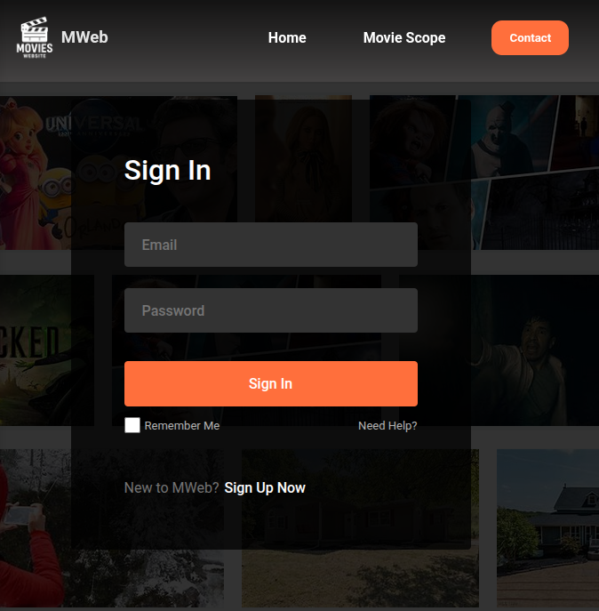
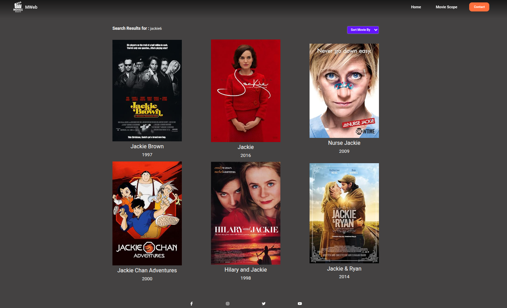
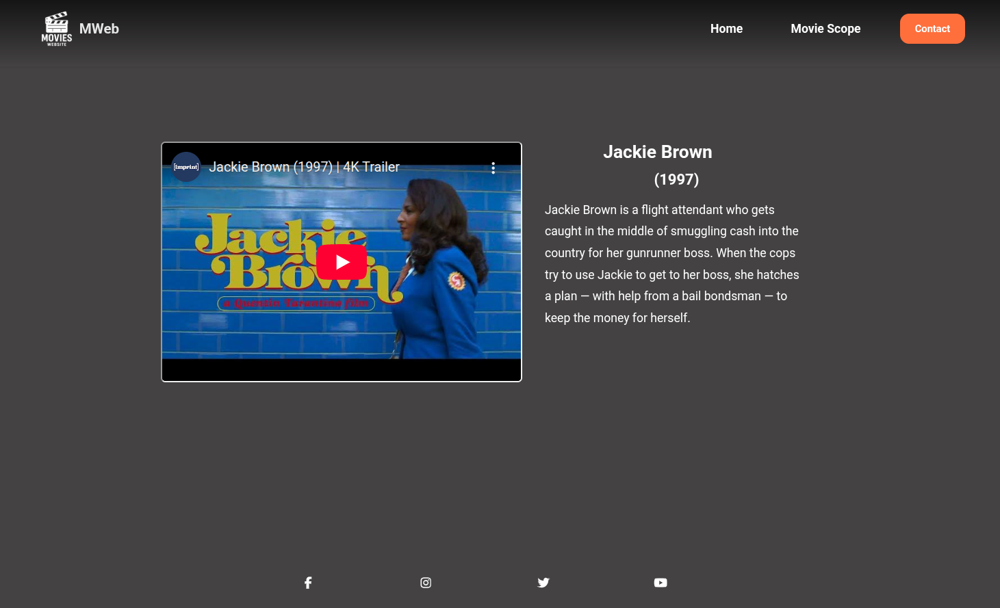

**React Movie App**

This project is a React-based web application that allows users to sign up, log in, and explore movies with trailers integrated from external APIs. It is structured in three main stages:

**Credentials Stage (Authentication with Firebase)**

**IMDB Stage (Movie Metadata Retrieval)**

**TMDB Stage (Trailer and Media Integration)**

**Features**

User Authentication (Sign-up, Login, Logout) using Firebase Authentication

Movie Data Display using IMDB data (titles, release years, posters)

Trailer Integration using TMDB APIs (movies & TV shows)

React Router for navigation between pages

**Project Stages**
1. Credentials Stage – Authentication

    Implemented sign-up, login, and logout features.

    Powered by Firebase Authentication, storing user credentials (username, email, password) securely in Firebase’s backend.

    Returning users can log in with their registered email and password without needing to re-register.

    React Hooks (useState, useEffect) were used to manage authentication states and redirect users dynamically.

2. IMDB Stage – Movie Metadata

    Integrated the IMDB API (Internet Movie Database) to fetch movie details.

    Six movies were abstracted with the following details:

     Title

     Year of release

     Unique IMDB ID (imdbid)

        The imdbid acts as the bridge between IMDB and TMDB APIs.

3. TMDB Stage – Trailer Integration

    The TMDB API (The Movie Database) was used to fetch trailers corresponding to IMDB IDs.

    Workflow:

        Extract imdbid from IMDB data.

        Map the ID to TMDB API results.

        Retrieve trailer links for movies and TV shows.

    TMDB API returns three categories:

        Movies
        TV Shows
        People

    In this project, Movies and TV Shows were used to embed trailers in the app.

4. Tech Stack

    Frontend: React (Hooks, Router)

    Authentication: Firebase Authentication

    APIs:

        IMDB API (movie data)
        TMDB API (trailers & extended metadata)
        Styling: CSS, Flexbox, Responsive Layouts

    Package Manager: npm

File Structure
src/
│── assets/               
│── components/          
│    ├── Nav/           
│    ├── Footer/          
│    └── Movies/             
│
│── context/              
│── pages/               
│    ├── Home/             
│    ├── Login/                 
│    ├── Search/          
│    └── MovieDetail/     
│
│── services/             
│    ├── imdbService.js    
│    └── tmdbService.js    
│
│── hooks/                
│── App.js             
│── index.js               
│── index.css             
│── firebase.js          

Usage Examples
    Fetch Movies from IMDB
    // src/services/imdbService.js
    
    const API_KEY = process.env.REACT_APP_IMDB_API_KEY;
    export async function fetchMovies() {
    const res = await fetch(
    `https://imdb-api.com/en/API/Top250Movies/${API_KEY}`
  );
  const data = await res.json();
  return data.items.slice(0, 6); // Get top 6 movies
}

    Fetch Trailers from TMDB
// src/services/tmdbService.js
const API_KEY = process.env.REACT_APP_TMDB_API_KEY;

export async function fetchTrailer(imdbId) {
  const res = await fetch(
    `https://api.themoviedb.org/3/find/${imdbId}?api_key=${API_KEY}&external_source=imdb_id`
  );
  const data = await res.json();

  const media = data.movie_results[0] || data.tv_results[0];
  if (!media) return null;

  const videoRes = await fetch(
    `https://api.themoviedb.org/3/movie/${media.id}/videos?api_key=${API_KEY}`
  );
  const videoData = await videoRes.json();

  return videoData.results.find((v) => v.type === "Trailer")?.key || null;
}

Demo

Sign-up/Login page

Movie listings from IMDB

Trailer playback from TMDB

Installation & Setup

Clone the repository:

git clone https://github.com/your-username/react-movie-app.git
cd react-movie-app

Install dependencies:

npm install

Create a .env file with your Firebase and API credentials:

REACT_APP_FIREBASE_API_KEY=your_api_key
REACT_APP_IMDB_API_KEY=your_api_key
REACT_APP_TMDB_API_KEY=your_api_key

Start the development server:

npm start

Open the app at http://localhost:3000

 Known Issues & Limitations

    API Rate Limits

    IMDB and TMDB free tiers have strict request limits. Excessive usage may cause errors.

    Trailer Availability

        Not all movies have trailers available on TMDB. In such cases, a “No trailer available” message is shown.

     Regional Restrictions

        Some trailer videos hosted on YouTube (via TMDB) may be blocked in certain regions.

    API Inconsistency

        IMDB IDs may not always map perfectly with TMDB results. Some movies could fail to fetch trailers.

    Development vs. Production

        Firebase credentials must be set up correctly in both local .env and deployment environments, otherwise authentication will fail.

    Future Improvements

        Add search functionality for movies and TV shows.

        Implement favorites/watchlist feature tied to Firebase database.

        Add profile management (username, avatar, saved movies).

        Enhance UI with TailwindCSS or Material UI.
